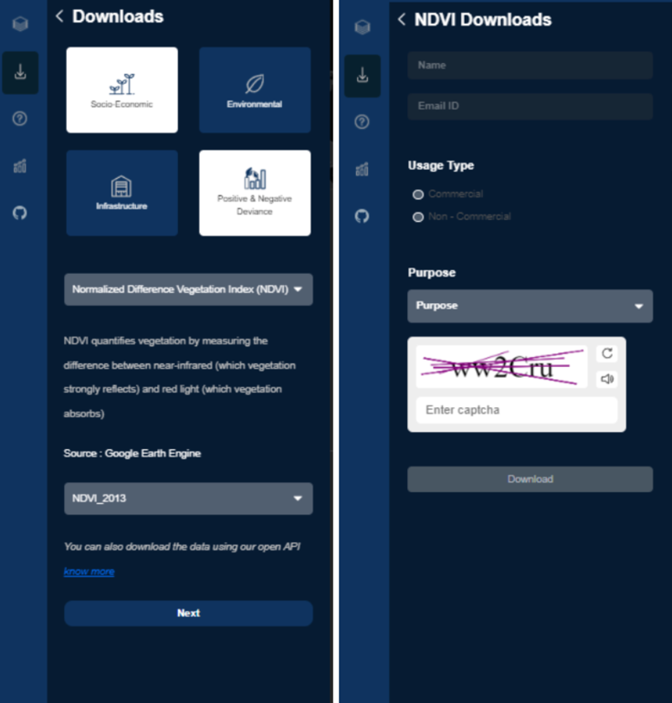

# Data Download Guide

This guide summarizes the steps for downloading layers from the DiCRA portal.

## Steps to Download a Layer
1. **Select the layer.**
2. **Choose the date** (only for layers with temporal data).
3. **Select the data type**: Raster or Vector.
4. **Select a boundary** (only when the layer type is Vector).
5. **Enter your name** (person requesting the download).
6. **Enter your email ID.**
7. **Choose usage type**: Commercial or Non-Commercial.

