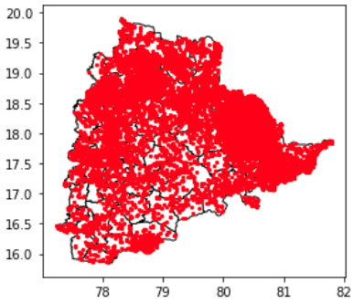
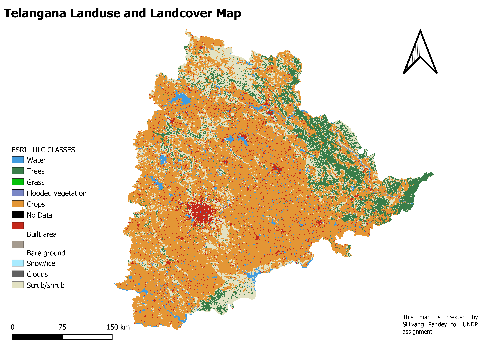
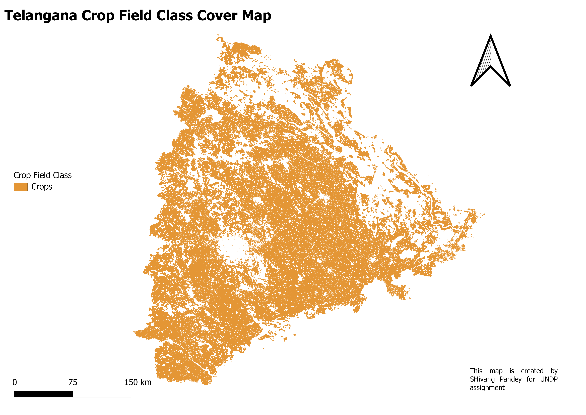
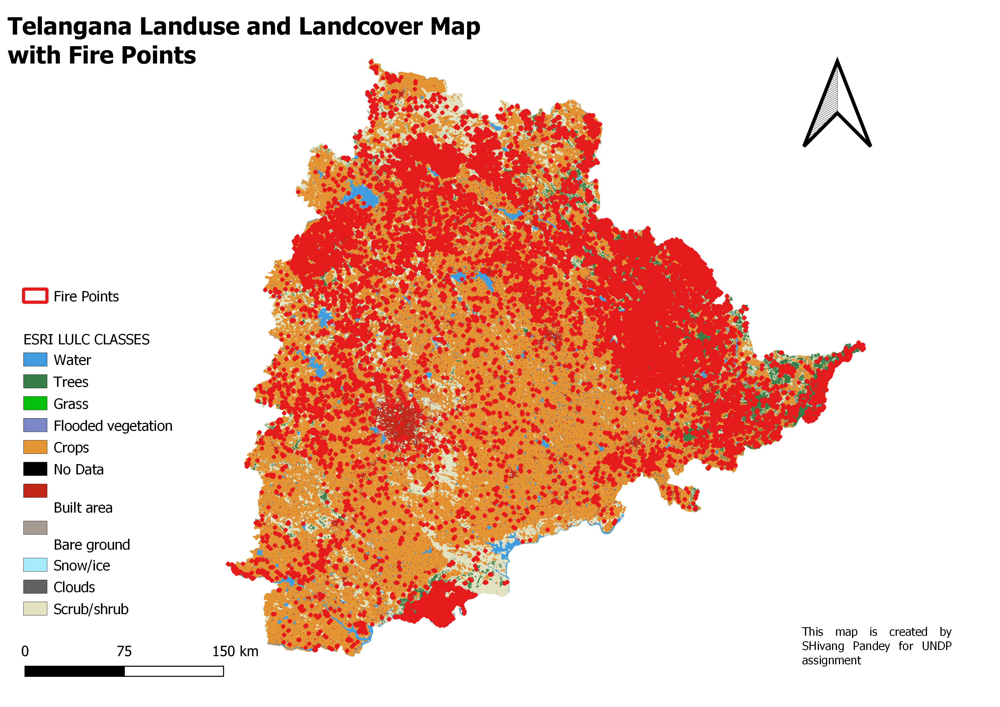
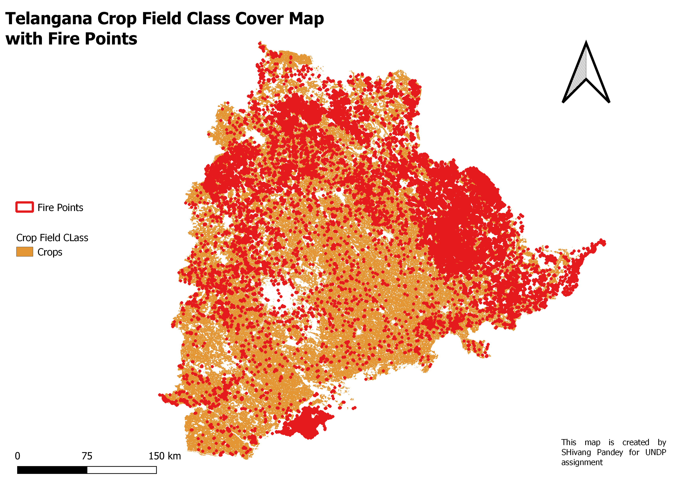

# Crop Residue Burning in Telangana - UNDP DiCRA 

An Indian Agricultural Research Institute study estimates that in 2008–09, the particulate released by crop residue burning is more than 17 times the total annual particulate pollution in Delhi from all sources - vehicles, industries, garbage burning, etc. Similarly, the total national annual emission for CO2 from crop residue burning is more than 64 times the total annual CO2 pollution emission in Delhi. India is the second-largest producer of rice worldwide. Paddy and wheat cropping are a widespread farming practice in northwestern parts of India; however, the burning of paddy and wheat straw and stubble by farmers after the harvesting season is quite common.

Currently, the DiCRA Platform is focusing on Telangana, and hence for the assessment, you will be provided with datasets pertaining to Telangana.

[Medium Post](https://medium.com/@shivangpandey/crop-residue-burning-in-telangana-undp-dicra-35f63aed777)


# TASK-1 


This task is to provide a JSON output that summarises the number of fires per administrative boundary per year in Telangana. The JSON output should include the following keys - adm_name, year, fireCount. Please use the same key names and boundary names.

First, all necessary libraries have to be installed like pandas, rtree, pygeos, and pandas.<br>
pandas: This library can be used for converting a set of data into a data frame and doing necessary operations on them.<br>
geopandas: This library can be used as pandas for spatial data and for their visualization.<br>
pygeos, rtree: These are the dependent libraries that have to be installed for geopandas.

<br>
```Python3
!pip install pandas
!pip install rtree
!pip install pygeos
!pip install geopandas
```
<br>

## Importing Libraries

geopandas and pandas are imported as gpd and pd respectively to use their functions with short forms.<br>
<br>
```Python3
import geopandas as gpd
import pandas as pd
```
<br>

## Creating DataFrame with given datasets


Firstly, we need to download the administrative boundaries of India from [GADM level 3](https://gadm.org/), and further features are extracted for the Telangana state boundary using QGIS. <br>
<br>
As fire_points are read as comma-separated values, we have to assign latitude and longitude values to use as a geodataframe. We will create a pandas data frame _'fire_points'_ and extract the longitude and latitude column from it. Further, we will assign geometry to each point using its longitude, latitude values in new geodataframe _'newdf'_.To create a geodataframe (_'pointstodist'_) which can show each fire point with administrative boundaries in which it is present, the administrative boundaries shapefile (dist.shp) and fire points in Telangana boundary are read using geopandas (_'adm_name'_ and _'nwedf'_)and joined together using _'sjoin'_ function of geopandas with the intersection of keys from both GeoDataFrames.

```Python3
#shapefile of districts of Telangana
adm_name = gpd.read_file('dist.shp')
#shapefile of fire data given
fire_points = pd.read_csv('telangana_fires.csv') 

#--------------Geodataframe for fire points--------------#
newdf = gpd.GeoDataFrame(fire_points, geometry=gpd.points_from_xy(fire_points.longitude, fire_points.latitude), crs=4326)

#--------------- using inner join to merge to geoDataFrames-------------#
pointstodist = gpd.sjoin(newdf, adm_name, how="inner", op='intersects')
```
<br>

## Creating JSON File:

The JSON output should include the following keys - adm_name, year, fireCount. For this, we need to rename geodataframe column _'NAME_3'_ as _'adm_name'_. Next, we will fetch years for each fire point from _'acq_date'_ and dump it into a new column named _'year'_. Now we have to count the fire points for each year and administrative boundary. This is done by creating an empty column in the data frame named as _'FireCount'_ and summing fire points grouping by _'adm_name'_ & _'year'_ .

Now, we will create a data frame that will be containing only three columns of the previous data frame named as _'adm_name'_, _'year'_ and _'fireCount'_ to dump in a JSON file named as _'output1.json'_.<br>
<br>

```Python3
#renaming column by districts
pointstodist = pointstodist.rename(columns={"NAME_3":"adm_name"})
#getting year from the date
pointstodist['year'] = pd. DatetimeIndex(pointstodist['acq_date']).year
#declaring firecount column by 1
pointstodist['fireCount']=1
#suming the occurence of fire by grouping district and year
new_df = pointstodist.groupby(['adm_name','year']).sum()  
new_df = new_df.reset_index()

#creating new Dataframe to dumping json
json_pd = new_df[['adm_name','year','fireCount']]
#dumping to json file
json_pd = json_pd.to_json('output1.json', orient="records", lines=True)     
```

<br><br><br>

# TASK-2

The task is to create a JSON output that gives the probability of a fire being caused by agricultural practices.
The JSON output should include the following keys - fireID, probability<br>

First, all necessary libraries have to be installed like pandas, geopandas, rasterio, and rasterstats<br>
pandas: This library can be used for converting a set of data into a data frame and doing necessary operations on them.<br>
geopandas: This library can be used as pandas for spatial data and for their visualization <br>
rasterio: To do operations on raster datasets.<br>
rasterstats: For summarizing geospatial raster datasets based on vector geometries. It includes functions for zonal statistics and interpolated point queries.<br> 
<br>

```Python3
#install dependent libraries

!pip install geopandas
!pip install rasterio
!pip install rasterstats
```
<br>

## Importing Libraries

geopandas and pandas are imported as gpd and pd respectively to use their functions with short forms. <br>
rasterio and rasterstats have been imported for raster analysis. zonal_stats of rasterstats is imported to get statistics of raster within a given polygon and plot of rasterio shows is imported for visualization.<br>

```Python3
import geopandas as gpd
import pandas as pd

import rasterio
from rasterstats import zonal_stats
from rasterio.plot import show
```
<br>

## Creating DataFrame with given datasets

As fire_points are read as comma-separated values, we have to assign latitude and longitude values to use as a geodataframe. We will create a pandas data frame _'fire_points'_ and extract the longitude and latitude column from it. Further, we will assign geometry to each point using its longitude, latitude values in the new geodataframe _'newdf'_.<br>
_'dist.shp'_ is also been read to get shapefile information according to administrative boundaries.<br>

```Python3
#get fire points in pandas dataframe
fire_points = pd.read_csv('telangana_fires.csv')

#create GeoDataFrame using latitute longitude values
newdf = gpd.GeoDataFrame(fire_points,
                         geometry=gpd.points_from_xy(fire_points.longitude,
                                                    fire_points.latitude)) 

state = gpd.read_file('dist.shp')                             #read state shapefile as GeoDataFrame
base = state.plot(color='white', edgecolor='black')           #make Telangana map as basemap
newdf.plot(ax=base, marker='o', color='red', markersize=5);   # plot fire points on Telanagana state map
```
<br>



Now we have to create polygons to get the probability of fire point having in an agricultural class. As given fire point data is prepared using MODIS Thermal Anomalies & Fire Daily data, we will be taking a resolution of 1km of one pixel.

So, the buffer function of geopandas (based on the shapely library) is to create a buffer polygon around a point. The first parameter of the buffer is to tell length in the degree to mark the point in a square pixel and 'cap_style' to tell the type of polygon. here _'cap_style = 3'_ means square polygon for buffer point. Later, we will be changing the geometry of the geodataframe from point to polygon and will dump it in a new shapefile named as _'fire_polygon.shp'_.
<br>

```Python3
polygons = []

#-------create a buffer of square of 1km size using buffer function from shapely-----#
for i in newdf.geometry:
    p1 = i
    buffer = p1.buffer(0.004504505, cap_style = 3)         #500m = 0.004504505 and cap_style 3 is square box of same of 1km side length
    polygons.append(buffer)

#create a new column in GeoDataFrame newdf and dump polygon buffer of respective point values
newdf['geometry'] = polygons

#dump mulyipolygon data to a shapefile for visualization later
newdf.to_file('fire_polygon.shp', crs=4326)     
```
<br>

## Reading tiff files of esri LULC 10m resolution maps

Here, we have to use the esri LULC map of 10m resolution to show agricultural class also known as _crop class_ in given LULC maps. <br><br>
The LULC maps are available from the year 2017 to 2021 but we will be using only 2021 for this model as it will be easier to import because georeferenced files can be big as much as 6GB for a single tile and the Telangana region covers at least Four tiles in given esri LULC maps. <br>
We can use these tiff files in two ways, either use each tiff file or mosaic them as one. <br> For both cases, logic is given here! <br><br> All four tiff files named as _tiff1.tif, tiff2.tif, tiff3.tif and tiff4.tif_ and mosaiced one using _ERDAS Imagine software_ named as _vmcx_mosiac_reprj.tif_. <br> Georeferencing of these files is done on open source _QGIS_ software. <br>
All tiff files are collected in a list named _'tiff_files_' and mosaic named as _' tiff'_.

```Python3
# taking four tiff files of esri which including Telangana state area 
tiff_files = ['tiff1.tif', 'tiff2.tif', 'tiff3.tif', 'tiff4.tif']    
#single mosaic image of esri lulc tifs which contains Telangana state area
tiff = 'vmcx_mosiac_reprj.tif'          
```
<br>

## Reading fire polygon shapefile

A new column has been created named as _'index'_ to get assign _'fire_ID'_ to each point (now Polygon)
<br>
```Python3
#reading multi-polygon shapefile
data = gpd.read_file("fire_polygon.shp")

#giving fire points and ID as per their index value
data['index']=data.index   
```
<br>

## Calculating Probabilty
I know still one question is unanswered yet. Why a polygon of a point??!! <br><br>
So MODIS Thermal Anomalies & Fire Daily data is calculated on 1km resolution and given esri LULC data is at 10m resolution and we can say it like that 1 pixel of MODIS fire data should be as big as 10000 pixels of LULC map.<br> How we are going to use that? by creating a polygon as a size of 10000 pixels of LULC map. <br><br>
So how it is going to help us in calculating probability? <br> 10000 pixels of LULC can have pixels of all classes. We just have to take the ratio of the number of pixels of crop class which is 5 and the total number of pixels within polygon:<br>
P(A) = No. of crop class(5) pixels / Total no. of pixels<br><br>
The first snippet here is showing how to iterate both tiff files and fire polygons calculating fire probability from it.<br> We have used a timer here to check how much time is going to take to run.

#### NOTE: AS INDIVIDUAL GEOTIFF FILES ARE LARGE IN SIZE (>5Gb), THIS STEP AVOIDED AND MOSAIC GEOTIFF FILE HAS BEEN USED FOR RASTER CALCULATIONS

```Python3
#------------------Checking probability in tiff file list----------------------#
import time                                   #to calculate time taken to run the model
start_time = time.time()                      #start time of the program

index_list = []                               #declaring empty to get corresponding id of fire point
prob_list = []                                #empty list to store probability of corresponding fire points based polygon
for tiff in tiff_files:
    
    for j in range(len(data)):                #iterating all rows of dataframe to get polygon info

        stats = zonal_stats(data.iloc[j].geometry, tiff, stats="*", categorical=True)         #getting statistics from the raster within the polygon 
        i = stats[0]                                                                          #storing statsistical dictionary in a value
        if i['count'] != 0:                                                                   #check if polygon is within the tiff file or not
            index = data.iloc[j]['index']                                                     #get id of polygon
            index_list.append(index)                                                          #store id in a list
            if 5 in i:                                                                        #check if crop class is in polygon region or not
                prob = i[5]/i['count']                                                        #calculate probabilty of fire in crop field
            else:
                prob = 0                                                                      # if crop class is not in polygon, return 0 pixels
            prob_list.append(prob)                                                            #store probability in a list
            
            
print("--- %s seconds ---" % (time.time() - start_time))                                      #print total time taken to run code
```
<br>

This second snippet here is showing how to iterate only fire polygons and calculate fire probability using Mosiac tiff.<br> We have used a timer here to check how much time is going to take to run.

NOTE: Ignore the warning which is coming because of no information of one pixel due to change in projection
<br>

```Python3
#------------------Checking probability in mosaic tiff file----------------------#
import time                                      #to calculate time taken to run the model
start_time = time.time()                         #start time of the program

index_list = []                               #declaring empty to get corresponding id of fire point
prob_list = []                                #empty list to store probability of corresponding fire points based polygon
    
for j in range(len(data)):                #iterating all rows of dataframe to get polygon info

    stats = zonal_stats(data.iloc[j].geometry, tiff, stats="*", categorical=True)         #getting statistics from the raster within the polygon 
    i = stats[0]                                                                          #storing statsistical dictionary in a value
    if i['count'] != 0:                                                                   #check if polygon is within the tiff file or not
        index = data.iloc[j]['index']                                                     #get id of polygon
        index_list.append(index)                                                          #store id in a list
        if 5 in i:                                                                        #check if crop class is in polygon region or not
            prob = i[5]/i['count']                                                        #calculate probabilty of fire in crop field
        else:
            prob = 0                                                                      # if crop class is not in polygon, return 0 pixels
        prob_list.append(prob)                                                            #store probability in a list
        
print("--- %s seconds ---" % (time.time() - start_time))                                  #print total time taken to run code 
```

## Making JSON file
Code for mosaic tif file took less time than the previous one because of single iteration takes less Big O notation as compared to multiple iterations. <br><br> Also, multiple files' results can give overlapping fire points but that can be eliminated while simply making a dictionary from it. <br><br>
We can dump both ID and probability lits into a dictionary which can be read as data frame later to dump data into JSON file _'output2.json'_ including the following keys - fireID, probability<br>
<br>

```Python3
#dictionary created wth fireID and probability
id_prob = {key: value for key, value in zip(index_list, prob_list)}

#creating tuple of each key and  value pair
data_items = id_prob.items()                                                
#dumping all tuples in a list
data_list = list(data_items)

#creating DataFrame with id and probability values
prob_df = pd.DataFrame(data_list, columns= ['fireID','probability'])
#dumping to json file
prob_df = prob_df.to_json('output2.json', orient="records", lines=True)  
```
<br>

One more parameter that can be included as a calculating probability is known as _'confidence_' value of fire points and it is given as a column in MODIS data. <br><br> Confidence value of point tells what is the probability that point is detected as a thermal anomaly as a whole using satellite sensor data. And our probability value is the telling ratio of the number of pixels of all classes and the total number of probability.<br><br>
Both are independent of each other hence condition for mutually exclusive events will hold true here.<br><br>
P(A∩B) = P(A) · P(B) where, <br>P(A) is probabilty of pixel to be crop field and,<br> P(B) is confidence value of that particular fire point.<br><br>
P(A∩B) is telling the true probability of fire points. <br><br>
NOTE: Only ratio of pixels has been dumped into _'output2.json'_ to reduce the complexity of model but code for true probability is given below:

```Python3
#taking confidence values of points in list  
confidence = list(data["confidence"])                                       
#calculating total probability
true_prob = [(confidence[i]/100) * prob_list[i] for i in range(len(confidence))]      
#ziping fire ID and true probabilty in a dictionary
id_true_prob = {key: value for key, value in zip(index_list, true_prob)}

#creating tuple of each key and  value pair
data_items = id_true_prob.items()                                                
#dumping all tuples in a list
data_list = list(data_items)

#dumping to json file
#-------------NOT USING THIS LINE TO REDUCE COMPLEXLITY IN UNDERSTANDING OF THE MODEL --------#
id_true_prob = id_true_prob.to_json('output2.json', orient="records", lines=True)     
```
<br>

# EDIT:

## New output after task changed

To create a subset of this which gives the class of the fire as 1 if classified as caused by agricultural practices or 0 if not.<br>
<br>

```Python3
#create GeoDataFrame using latitute longitude values
newdf = gpd.GeoDataFrame(fire_points,
                         geometry=gpd.points_from_xy(fire_points.longitude,
                                                    fire_points.latitude)) 

#------------------Checking probability in mosaic tiff file----------------------#

index_list = []                               #declaring empty to get corresponding id of fire point
flag_list = []                                #empty list to store class of corresponding fire points based polygon
    
for j in range(len(data)):                #iterating all rows of dataframe to get point info

    stats = zonal_stats(newdf.iloc[j].geometry, tiff, stats="*", categorical=True)         #getting statistics from the raster point 
    i = stats[0]                                                                          #storing statsistical dictionary in a value
    if i['count'] != 0:                                                                   #check if polygon is within the tiff file or not
        index = data.iloc[j]['index']                                                     #get id of polygon
        index_list.append(index)                                                          #store id in a list
        if 5 in i:                                                                        #check if crop class is in polygon region or not
            flag = 1                                                        #calculate probabilty of fire in crop field
        else:
            flag = 0                                                                      # if crop class is not in polygon, return 0 pixels
        flag_list.append(flag)                                                            #store class value in a list
        
print("--- %s seconds ---" % (time.time() - start_time))                                  #print total time taken to run code 

#dictionary created wth fireID and class (1,0)
id_class = {key: value for key, value in zip(index_list, flag_list)}

#creating tuple of each key and  value pair
data_items = id_class.items()                                                
#dumping all tuples in a list
data_list = list(data_items)

#creating DataFrame with id and class values
class_df = pd.DataFrame(data_list, columns= ['fireID','class (1,0)'])
#dumping to json file
class_df = class_df.to_json('output2_new.json', orient="records", lines=True)  
```
<br>
<br>

# Some maps for Visual Pleasure :P

### Created on Open source _QGIS_






<br>

## References

- [Pandas Documentation](https://pandas.pydata.org/docs/)
- [GeoPandas Documentation](https://geopandas.org/en/stable/docs.html)
- [Rasterio Documentation](https://rasterio.readthedocs.io/en/latest/)
- [Rasterstats Documentation](https://pythonhosted.org/rasterstats/)
- [Stubble burning in Northern India](https://earthobservatory.nasa.gov/images/84680/stubble-burning-in-northern-india)
- [Active Fire Data - NASA | LANCE | FIRMS](https://firms.modaps.eosdis.nasa.gov/active_fire/)
- [NASA Firms Data Download](https://firms.modaps.eosdis.nasa.gov/download/Readme.txt)
- [Data4Policy Github Repository](https://github.com/UNDP-India/Data4Policy/tree/main/References)
- [NASA Fires Visualization for Telangana](https://public.flourish.studio/visualisation/8561801/)
- [Visualizing Climate and Loss: Crop Residue Burning in India](https://histecon.fas.harvard.edu/climate-loss/crops/index.html)
- [Esri 2020 Land Cover - Overview](https://www.arcgis.com/home/item.html?id=d6642f8a4f6d4685a24ae2dc0c73d4ac)
